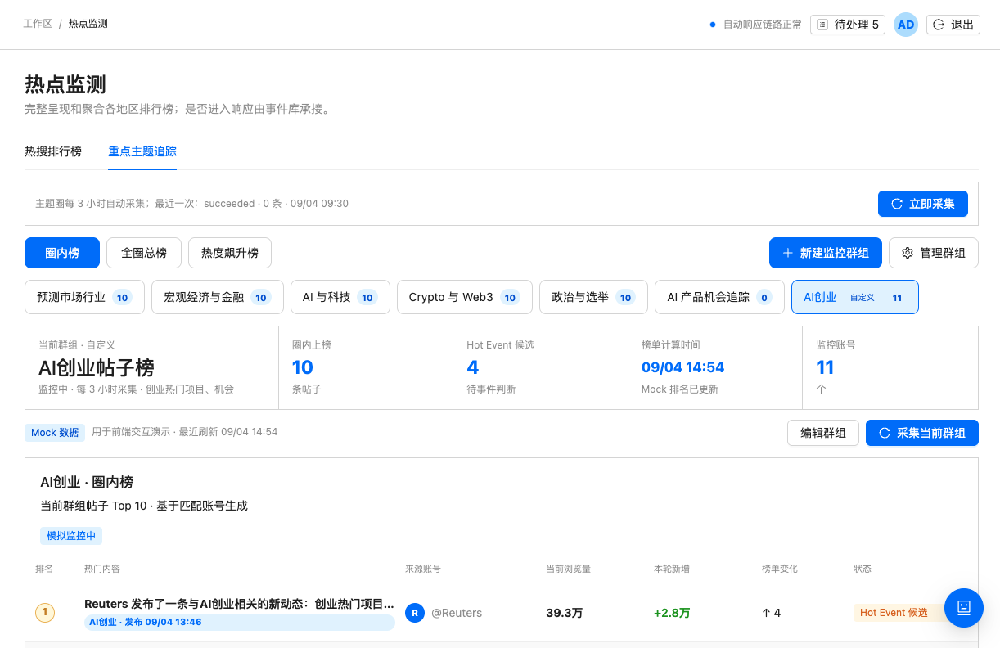

# 热点监控页面视觉与 UI 审查

## 审查范围

- 页面：`/monitor` → `重点主题追踪` → 自定义群组 `AI创业`
- 目标：快速判断当前群组状态、浏览榜单、刷新当前群组或创建/管理群组
- 证据：`01-custom-group-overview.png`（1222 × 792）
- 模式：UX + 可访问性风险联合审查

## Step 1：进入重点主题追踪页

健康度：良好

页面标题、一级页签和说明文字清楚，用户能判断自己处于“热点监控 / 重点主题追踪”。整体栅格稳定，左右边距一致，蓝色选中态统一。

## Step 2：选择榜单范围与主题群组

健康度：需优化

“重点主题追踪”“圈内榜 / 全圈总榜 / 热度飙升”“系统主题 / 自定义群组”形成三层并列导航，且都使用高对比的标签或按钮，用户需要先理解三层之间的关系。大量重复的数字徽标进一步增加视觉噪声。建议将榜单范围收敛为紧凑分段控件，将主题群组作为唯一主导航层；未选中的主题弱化背景与边框。

## Step 3：理解当前群组概况

健康度：需优化

摘要条覆盖了群组名称、上榜数、候选数、计算时间和账号数，信息完整。但第一格是名称和描述，其余是指标，语义不对称；同时“AI创业帖子榜”“AI创业 · 圈内榜”“当前群组 · 自定义”多次重复。建议把群组名称与描述提升为独立标题区，指标区只保留四个等宽数字指标。

## Step 4：执行采集与群组管理

健康度：有明显歧义

页面同时存在“立即采集”和“采集当前群组”两个高亮蓝色按钮，范围差异只靠文案推断；“新建监控群组”也是高权重蓝色按钮，导致三个主操作争夺注意力。建议把全局动作明确命名为“更新全部主题”，当前群组动作为“刷新本群组”；当前页面只保留一个主按钮，其余降为次级按钮。

此外，“succeeded · 0 条 · 09/04 09:30”与下方 10 条 Mock 榜单同时出现，虽然可能属于不同数据源，但页面没有解释范围，容易被理解为数据矛盾。应使用中文状态并明确采集范围。

## Step 5：浏览榜单内容

健康度：基本良好

榜单标题、表头、排名、作者、浏览量、增量、榜单变化和状态的阅读顺序合理，首行指标重点明确。主要问题是表头和辅助文字字号偏小、颜色过浅；右下角悬浮按钮覆盖了表格状态列附近的内容区域，在更多行或窄屏时会妨碍阅读和点击。

## 优先级建议

1. P1：消除三个蓝色主按钮的竞争，明确“全部主题”和“当前群组”的刷新范围。
2. P1：调整右下角悬浮按钮位置或为内容预留安全区，避免遮挡表格。
3. P2：将群组名称从指标条中独立出来，删除重复标题，摘要只承载同类指标。
4. P2：降低未选主题标签和重复数字徽标的视觉权重，建立清晰的三层筛选关系。
5. P2：统一语言，将 `succeeded`、`Hot Event` 等改为中文，并解释 Mock 数据与采集状态的关系。
6. P2：提高 12px 灰色辅助文字和表头的对比度；建议正文辅助色至少达到 WCAG AA 对比度要求。
7. P3：压缩顶部控制区的垂直占用，让榜单在首屏多露出 1–2 行内容。

## 可访问性风险与证据限制

- 截图中浅灰表头、时间和说明文字可能存在对比度不足风险，需要用实际颜色值测量确认。
- 悬浮按钮是否有可访问名称、键盘焦点是否清晰、标签页的语义和方向键操作无法从静态截图确认。
- 当前截图宽度为 1222px；主题标签在更窄窗口下的换行、溢出和缩放表现仍需单独测试。
- 本审查仅覆盖当前已加载状态，未覆盖加载中、空状态、错误状态、创建抽屉和管理弹窗。
